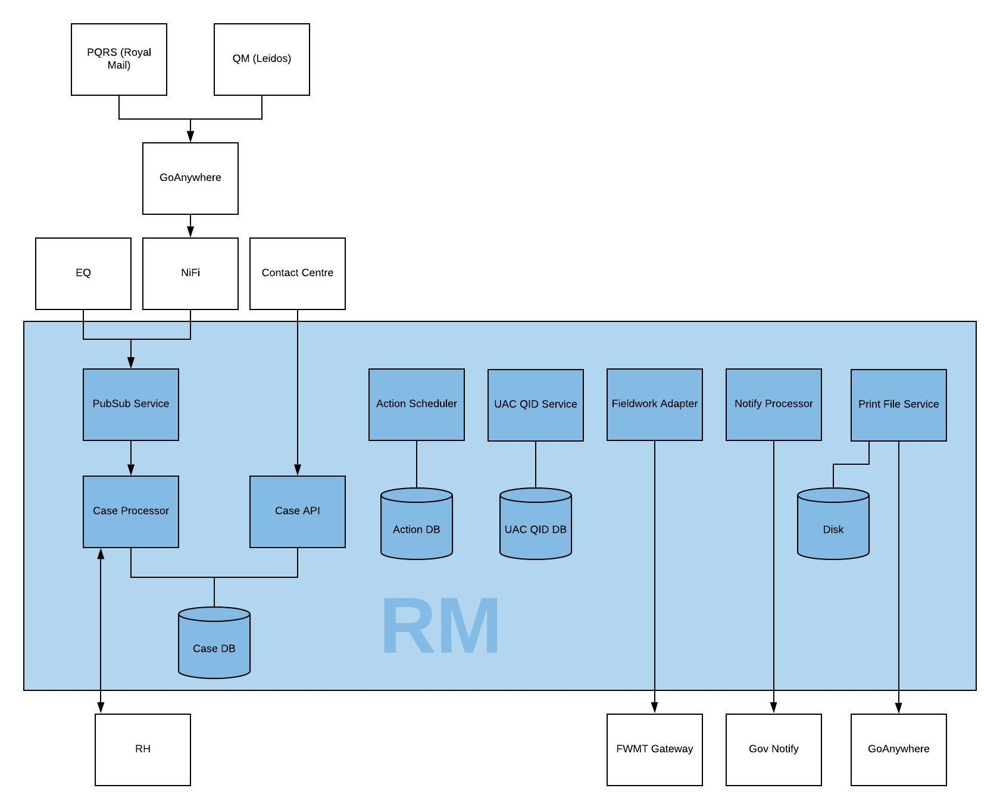

# census-rm
Census RM service level repository

### RM  Architecture



### RM Git repositories
#### Core repositories and infrastructure
For private repositories, you'll need to be logged in to Github and be a member of the correct user group.\
[Terraform](https://github.com/ONSdigital/census-rm-terraform) (Private)\
[Kubernetes](https://github.com/ONSdigital/census-rm-kubernetes) (Private)\
[Deployment pipelines](https://github.com/ONSdigital/census-rm-deploy)\
[Pubsub](https://github.com/ONSdigital/census-rm-pubsub)\
[Case Processor](https://github.com/ONSdigital/census-rm-case-processor)\
[Case API](https://github.com/ONSdigital/census-rm-case-api)\
[Action Scheduler](https://github.com/ONSdigital/census-rm-action-scheduler)\
[UAC QID Service](https://github.com/ONSdigital/census-rm-uac-qid-service) (Private)\
[Fieldwork Adapter](https://github.com/ONSdigital/census-rm-fieldwork-adapter)\
[Notify Processor](https://github.com/ONSdigital/census-rm-notify-processor)\
[Print File Service](https://github.com/ONSdigital/census-rm-print-file-service)\
[Exception Manager](https://github.com/ONSdigital/census-rm-exception-manager)

#### Optional repositories
These are deployed and used as and when required:\
[QID Batch Runner](https://github.com/ONSdigital/census-rm-qid-batch-runner)\
[Sample Loader](https://github.com/ONSdigital/census-rm-sample-loader)\
[DDL Scripts](https://github.com/ONSdigital/census-rm-ddl)

#### Dev tools and testing
[Docker Dev](https://github.com/ONSdigital/census-rm-docker-dev)\
[Toolbox](https://github.com/ONSdigital/census-rm-toolbox)\
[Census RM Ops](https://github.com/ONSdigital/census-rm-ops)\
[Acceptance tests](https://github.com/ONSdigital/census-rm-acceptance-tests)\
[Performance tests](https://github.com/ONSdigital/census-rm-performance-tests)


### Testing code in GCP

#### Make, tag and push a Docker image
1. Clone the required Git repo and checkout the required branch
1. Build the Docker image locally:
   * Python:
      * There should be a target in the makefile to build the Docker image.  Run that.  Otherwise:
      * ```docker build . -t <username>/<repo name>:latest```
   * Java:
      * Run ```mvn clean install```
1. Tag the resulting Docker image using your Docker username
   * ```docker tag <docker image name> <docker_username>/<repo_name>:<tag>```
1. Push the Docker image
   * Log into Docker hub: ```docker login```
   * Push the Docker image tagged in the step above: ```docker push <tagged_docker_image>```

#### Amend the Kubernetes config and deploy the service to your GCP environment
1. Amend the Kubernetes config to use the Docker image that you pushed to Docker hub in the previous step:
   * Most of the Kubernetes config lives in the [Kubernetes repo](https://github.com/ONSdigital/census-rm-kubernetes).
  Clone this locally and/or checkout and pull the latest Master changes
   * There's an ```<app_name>-deployment.yml``` file for each app.  Look for the ```image:``` tag within the 
  ```containers:``` section
   * Change the image name to the tagged Docker image that you created in step 3 above

2. Deploy the app by applying the config file amended in the previous step
   * IMPORTANT - Ensure that you're running against the correct Kubernetes 
   context, so  that you're not deploying to an environment you shouldn't be:
     * If you haven't already, add the context for your current environment by running ```gcloud container clusters get-credentials 
     <cluster name> --region <region> --project <projectc name>```
     * Set the current context:
       * The easiest way is to click the Docker icon at the top of the screen then select ```Kubernetes``` then the context
       * Alternatively: 
         * ```kubectl config get-contexts```
         * ```kubectl config set current-context <context name>```
     * Apply the Kubernetes script from step 1:
       * ```kubectl apply -f <filename.yml>```
3. Restart the application in GCP
   * Delete the running pod and allow GCP to start another one to pick up any changes
   
#### Run acceptance tests against your GCP environment
To run the full suite of acceptance tests against your GCP environment, follow the instructions 
[here](https://github.com/ONSdigital/census-rm-acceptance-tests/blob/master/README.md)